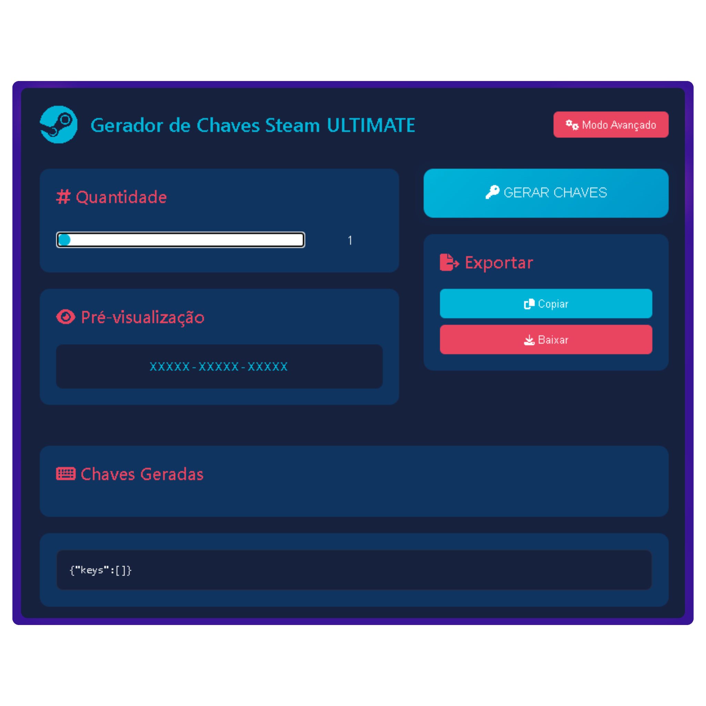

# Gerador de Chaves Steam Ultimate 🎮

Um gerador de chaves Steam com interface moderna, personalização avançada e recursos de exportação. Desenvolvido para fins educacionais e de teste.



> **Aviso Importante**  
> As chaves geradas possuem **chance extremamente baixa de funcionar**. Este projeto é apenas para demonstração técnica. Não nos responsabilizamos por qualquer uso indevido.

## Funcionalidades Principais ✨

- 🎲 Geração de chaves em diferentes formatos:
  - Padrão (5-5-5)
  - Estendido (4-4-4-4)
  - Retail (3-7-7)
  - Compacto (7-7)
  - Personalizado
- 🔒 Opções de segurança:
  - Níveis de complexidade (Baixa/Média/Alta)
  - Checksum de validação
  - Garantia de chaves únicas
- 📥 Exportação para JSON
- 📋 Copiar chaves individualmente ou em lote
- 🎨 Interface responsiva com tema escuro

## ⚠️ Funcionalidades em Manutenção
Algumas opções estão temporariamente indisponíveis devido a atualizações:
```plaintext
- Configuração de hífens
- Controle de maiúsculas/minúsculas
- Filtro de caracteres ambíguos
## Tecnologias Utilizadas 🛠️
# Steam Key Generator

Este projeto é um gerador simples de chaves no estilo Steam, desenvolvido com tecnologias modernas de frontend.

---

## Frontend

- **HTML5 Semântico**
- **CSS3** com Variáveis Customizadas
- **JavaScript ES6+**

## Bibliotecas

- **Font Awesome 6.4.0** (Ícones)
- **Web APIs** (Clipboard, Blob)

## Como Usar 🚀

### Pré-requisitos

- Navegador moderno (Chrome 90+, Firefox 88+)
- Conexão com internet (para carregar ícones)

### Execução Local

```bash
git clone https://github.com/seu-usuario/steam-key-generator.git
cd steam-key-generator
# Basta abrir o index.html em seu navegador
```

## Fluxo de Trabalho

1. Ajuste a quantidade desejada usando o slider
2. Selecione o formato das chaves
3. Configure as opções de segurança
4. Clique em **GERAR CHAVES**
5. Exporte ou copie os resultados

## Estrutura de Arquivos 📂

```bash
tree
.
├── index.html          - Estrutura principal
├── style.css           - Estilos e tema visual
├── app.js              - Lógica principal do gerador
└── README.md           - Documentação do projeto
```

## Personalização Avançada ⚙️

Acesse o Modo Avançado para:

- Definir formato personalizado
- Configurar complexidade de segurança
- Habilitar validação por checksum
- Controlar mix de caracteres

### Exemplo de formato customizado

```javascript
// Padrão: XXX-XXXX-XXXXX
document.getElementById('customFormatInput').value = 'XXX-XXXX-XXXXX';
```

## Limitações Conhecidas ⚠️

- Geração limitada a **100.000** chaves por vez
- Performance pode degradar com **>10.000** chaves
- Checksum não segue padrão Steam oficial
- Não inclui validação de servidor

